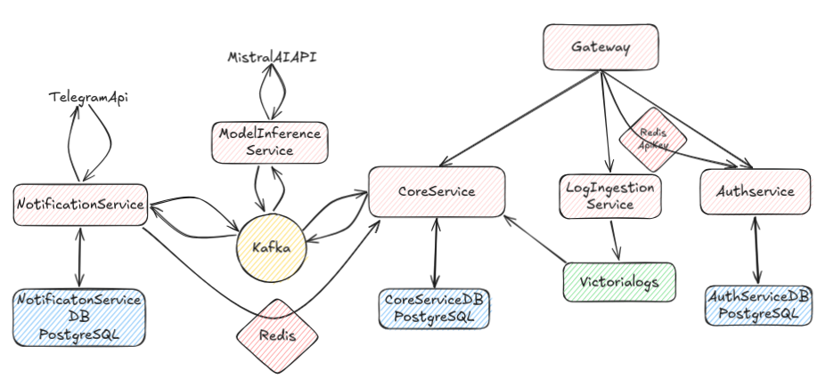

я# Smart Logger
Приложение для умной обработки и мониторинга логов на сервисах spring-boot
https://github.com/VlBurakevich/smart-log-starter 
стартер для отправки логов

### Технологический стек
Technology Stack - Java 21, Spring Boot 3.5, Spring Cloud, Kafka, PostgreSQL, Redis, VictoriaLogs, Mistral AI, Docker

###  Telegram Bot Commands
- /start, /services, /report, /help, /unbind    
Также телеграм может сам уведомлять если произошла ошибка и сервис лежит

### .env variables:
- MISTRAL_API_KEY
- TELEGRAM_API_TOKEN

### Использование
пользователь регистрируется в системе, создаёт api ключ и задачу мониторинга,  
импортирует стартер и настраивает конфиг
- https://github.com/VlBurakevich/smart-log-starter  

стартер отсылает логи сервиса на сервер для анализа  
пользователь регистрируется в телеграмме и может получать сообщения об ошибках или запрашивать report

### Примерная Архитектура

